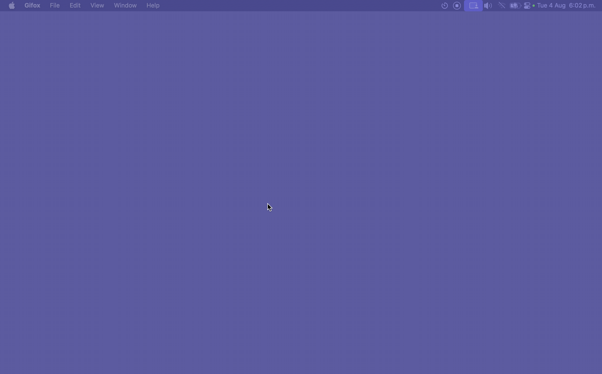

# MiniClockify



A lean macOS menu bar app for fast [Clockify](https://clockify.me) time tracking.
Built for one thing: log your time without breaking your flow.

No history window, no dashboards, no browser tab to hunt for. One hotkey in, one
key out. Your hands never leave the keyboard and your focus never leaves the work.

## The flow

Everything runs through a single global hotkey (default **⌃⌥⌘⇧C**):

1. **Start** — Hit the hotkey. A floating quick-entry panel drops in. Type a
   description (or leave it blank), press **Enter**. A timer starts against your
   last-used project. Panel disappears. You're back to work in under two seconds.
2. **Stop** — Hit the same hotkey. A stop-confirm panel appears. Press **Enter**
   to stop and log the entry. Done.
3. **Bail** — Changed your mind? **Esc** dismisses either panel. Nothing happens.

That's the whole app. No mouse required, ever.

## Why it stays out of your way

- **One hotkey does both** — Start and stop share the same binding. Muscle
  memory handles it; you don't think about app state, you just tap the keys.
- **Floating panel, not a window** — The quick-entry panel appears over whatever
  you're doing and vanishes the moment you commit. Your window layout is never
  disturbed.
- **Smart project defaults** — No project picker in the hot path. The timer runs
  against your last-used project automatically, falling back to your most recent
  server project, then your first project. Pick once, forget forever.
- **Lives in the menu bar** — No Dock icon (`LSUIElement`), no window clutter.
  The menu bar shows your running timer's elapsed time at a glance.
- **Survives relaunch** — Rebind the hotkey in Preferences and it sticks. If a
  timer is already running on the Clockify server when the app launches, it
  adopts it instead of starting fresh.
- **Fails safe** — If a start or stop request fails, the app keeps its state and
  surfaces the error so you can retry — it never silently drops your time.

## Keyboard reference

| Key | Where | Action |
| --- | --- | --- |
| **⌃⌥⌘⇧C** (rebindable) | Anywhere | Open quick-entry / stop-confirm panel |
| **Enter** | Quick-entry panel | Start timer against last-used project |
| **Enter** | Stop-confirm panel | Stop timer and log the entry |
| **Esc** | Either panel | Dismiss without doing anything |
| **Esc** | Preferences window | Close the window (app keeps running) |

The hotkey is fully rebindable from Preferences — press the button, type your
combo (at least one modifier), Save.

## Installing

MiniClockify is only ad-hoc signed (no Apple Developer ID), so Gatekeeper will
refuse to open it until you strip the quarantine attribute macOS adds to
downloaded apps.

1. Move `MiniClockify.app` into `/Applications` (or wherever you keep apps).
2. Clear the quarantine flag so macOS will let it run:

   ```bash
   xattr -cr /Applications/MiniClockify.app
   ```

   `-c` clears extended attributes, `-r` recurses into the bundle. Without this
   you'll get an "app is damaged / can't be opened" or "unidentified developer"
   warning.
3. Open the app. Grant any macOS permission prompts (notifications) it requests.

## Setup

1. Grab your API key from Clockify: open
   [**Profile → Preferences → Advanced**](https://app.clockify.me/user/preferences#advanced),
   scroll to the **API** section, and generate/copy your key.
2. Launch MiniClockify and paste the key into the auth window. It's stored in the
   macOS Keychain, never on disk in plain text.
3. Set your hotkey in Preferences (or keep the default).

## Building from source

Requires macOS 14+ and a Swift 6 toolchain. No third-party dependencies.

```bash
swift build            # debug build
swift test             # run the test suite

./build-app.sh release # build the .app bundle + ad-hoc codesign
./build                # rebuild the bundle and relaunch the running app
```

> Ad-hoc codesigning (`build-app.sh`) is required for Keychain access and
> notifications to work — the bare binary won't have them.

## Under the hood

SwiftUI + AppKit, Swift 6 with strict concurrency, macOS 14+. The global hotkey
is the one Carbon holdout (`RegisterEventHotKey`) because SwiftUI has no
system-wide hotkey API. Architecture notes live in
[`CLAUDE.md`](CLAUDE.md); the original design spec is in
`docs/superpowers/specs/2026-08-04-clockify-menubar-design.md`.
